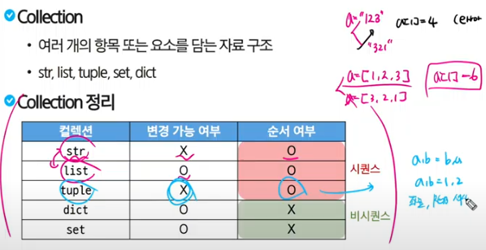

## 변수
### 값을 저장하기 위한 이름, 특정 값을 담아두었다가 필요할 때 꺼내 쓺
#### 할당문
- variable = expression(표현식)
- degrees = 36.5 변수 degrees에 값 36.5를 할당했다
- degrees = 'abc' 변수 degrees에 값 'abc'를 재할당했다
- 존재하지 않는 변수는 생성해주기
- 주소에 값을 저장, 변수는 값이 아닌 주소를 저장
### 데이터 타입
#### 필요 이유
- 값을 구분하고 어떻게 다룰지 알 수 있음
#### int
- 정수를 표현한 자료형
- a = 10, b = 0 등등
- 진수도 가능
- print(0b10) # 2, print(0x10) # 16
#### float
- 실수형(소수 포함)
- e 또는 E를 사용
- number = 314e-2
- 그냥 3.14도 가능하지만 ex 0.1이라면 2진수로 0.000110011001100... 인데 15~16자리에서 자름 그래서 +나 -를 할 때 1.0000000007 이랑 0.99999999997이 될 수 있음
##### 부동소수점 해결책
- from decimal inport decimal
- decimal('3.2')-decimal('3.1') #decimal을 쓰면 비트로 바꿔서 저장x 실수형으로 바로 저장
#### Sequence Types
- 순서: 값들이 순서대로 저장(정렬x)
- 인덱싱: 각 값의 고유 번호, 특정 위치 값을 선택 수정 가능
- 슬라이싱: 자른다 [::]
##### 인덱싱
- 각 고유 번호와 위치
- my_str = 'hello' print(my_str[1]) e
##### 슬라이싱
- print(my_str[2:4]) 시작 포함 끝 포함x
- python은 뒤부터도 가능 뒤부터 -1, -2, -3 ...
- print(my_str[:3]) print(my_str[2:])앞이나 뒤를 생략하면 0부터 or 끝까지
- print(my_str[0:5:2]) 격자로 2칸 마다 0 2 4
- print(my_str[::-1]) -1은 뒤로 1칸씩
##### str
- 문자열 타입
- 순서가 있는 변경 불가한 시퀀스 자료형(연속적)
- 따옴표로 감싸서 표현('문자', "문자")
- 문자열 안에 따옴표를 쓰고 싶으면 다른 따온표로 감싸기('여기에"문자"를 사용')
- 안에 또 같은 따옴표를 쓰고 싶으면 역슬래쉬(\'문자\')
- 문자열 내에 변수나 표현식 사용법(f-string)(print(f'문자{변수1}{변수2}{변수3}'))
###### 문자열은 불변
- my_str = 'hello' my_str[1] = 'z'
- print하면 타입애러
##### list
- 여러 개의 값을 순서대로 저장하는 변경이 가능한 시퀀스
- 대괄호로 표현, 0개이상의 데이터, 어떤 자료형이든 가능(섞어서도 리스트도 가능)
- 리스트는 가변 mylist = [1,2,3] mylist[0] = 100 #[100, 2, 3]
- replace a = '123' b = a.replace('1', '4') print(b)
##### tuple
- 여러 개의 값을 순서대로 저장하는 변경 불가능한 시퀀스 자료형
- 빈거 아니면 다 콤마 찍기 my_tuple = () my_tuple = (1,) 콤마가 본체 ()없어도 ,만 있으면 튜플
##### range
- 연속된 정수 시퀀스를 생성하는 변경 불가능한 자료형
- range(시작, 끝, 증가)
#### none-Sequence Types
##### dict
- key - value 쌍으로 이뤄진 순서와 중복없는 변경 가능한 자료형
- 노래방 번호 느낌 (123 가시) (124 고기)
- key는 불변한 자료형만 사용
- value는 모든 자료형 가능
- 중괄호{}로 표기
###### default dict 사용
- from collection import defaultdict
- my_dict = defaultdict(int)
- my_dict['add_key'] = 'add_value'
- print(my_dict['add_key'])
- print(my_dict['none_key'])
- add value
- 0 # defaultdict의 초기값
##### set
- 순서와 중복이 없는 변경 가능한 자료형
- 중괄호{}로 표현
- my_set1 = {1,2,3}
- my_set2 = {1,1,1}
- my_set3 = set() # set 초기화
- a = set(1,2,3) X a = set((1,2,3)) or a = set([1,2,3])
- 합집합 | 차집합 - 교집합 &
##### None
- 파이썬에서 '값이 없음'을 표현하는 자료형
- val = None
- print(val) # None
##### Boolean
- 참과 거짓을 표현하는 자료형
- 비교/논리 연산의 평가 결과로 사용
- 주로 조건/반복문에 사용
- print(3>1) # True
- print('3' != 3) # True
- bool(0) # False bool(1), bool(2), bool(-1) # True
- bool('hello') # True bool('') # False
- bool() 0, [], () 등등 빈거면 False
##### 암시적 형변환
- 파이썬에서 자동으로 수행하는 형변환
- 데이터 손실이 없을때만 핢
- 정수와 실수의 연산에서 정수가 실수로 변환됨 # 더 큰 범위니까 데이터 손실 x
- Bool과 Numeric에서만 변환
- True + 3 # 4
- True + False # 1
##### 명시적 형변환
- 프로그래머가 직접 지정하는 형변환
- str -> int 형식에 맞는 숫자만
- '1' -> 1 o, '3.5' -> 3.5 x
## 연산자
### 산술 연산자
- '-음수, +, -, *, /, //(몫), %(나머지), **(제곱)'
### 복합 연산자
- 연산과 할당을 같이
- '+=, -=, *=, /=, //=, %=, **=' # a""b -> a = a""b
### 비교 연산자
- 부등호
- '<, <=, >, =>, ==, !=, is, is not'
#### is 연산자
- 메모리 내에 같은 객체를 참조하는지 확인
- ==는 동등성, is는 식별성
### 논리 연산자
- 'and, or, not'
#### 단축평가
- 논리 연산에서 두 번째 피연산자를 평가하지 않고 결과를 결정하는 동작
### 멤버쉽 연산자
- in, not in
### 시퀀스 연산자
- 문자끼리 더하기
- 문자*숫자 # 문자 여러번
- 리스트도 동일
### 참고
- 변수명은 직관적인 이름 (변수명 지어주는 사이트도 있음)
- 줄은 79개로 하고 넘어가면 줄바꿈 '\'
- 내부 예약어 사용x False, True, print 등등
- #은 주석 '''코드'''은 여러줄
- python tutor 사이트에서 python 클릭 render 뭐시기 클릭
- 
- 주소값 보려면 id(변수)