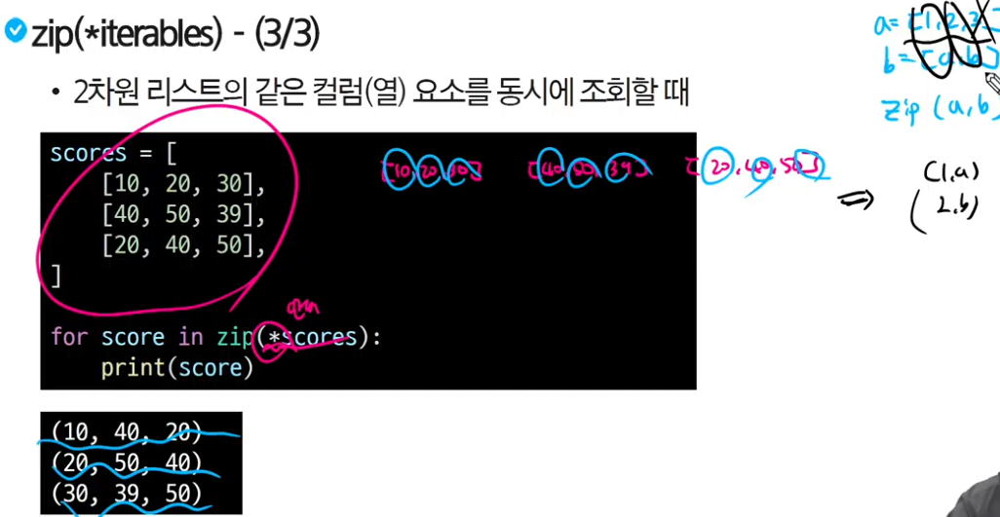

## 변수
### 값을 저장하기 위한 이름, 특정 값을 담아두었다가 필요할 때 꺼내 쓺
#### 할당문
- variable = expression(표현식)
- degrees = 36.5 변수 degrees에 값 36.5를 할당했다
- degrees = 'abc' 변수 degrees에 값 'abc'를 재할당했다
- 존재하지 않는 변수는 생성해주기
- 주소에 값을 저장, 변수는 값이 아닌 주소를 저장
### 데이터 타입
#### 필요 이유
- 값을 구분하고 어떻게 다룰지 알 수 있음
#### int
- 정수를 표현한 자료형
- a = 10, b = 0 등등
- 진수도 가능
- print(0b10) # 2, print(0x10) # 16
#### float
- 실수형(소수 포함)
- e 또는 E를 사용
- number = 314e-2
- 그냥 3.14도 가능하지만 ex 0.1이라면 2진수로 0.000110011001100... 인데 15~16자리에서 자름 그래서 +나 -를 할 때 1.0000000007 이랑 0.99999999997이 될 수 있음
##### 부동소수점 해결책
- from decimal inport decimal
- decimal('3.2')-decimal('3.1') #decimal을 쓰면 비트로 바꿔서 저장x 실수형으로 바로 저장
#### Sequence Types
- 순서: 값들이 순서대로 저장(정렬x)
- 인덱싱: 각 값의 고유 번호, 특정 위치 값을 선택 수정 가능
- 슬라이싱: 자른다 [::]
##### 인덱싱
- 각 고유 번호와 위치
- my_str = 'hello' print(my_str[1]) e
##### 슬라이싱
- print(my_str[2:4]) 시작 포함 끝 포함x
- python은 뒤부터도 가능 뒤부터 -1, -2, -3 ...
- print(my_str[:3]) print(my_str[2:])앞이나 뒤를 생략하면 0부터 or 끝까지
- print(my_str[0:5:2]) 격자로 2칸 마다 0 2 4
- print(my_str[::-1]) -1은 뒤로 1칸씩
##### str
- 문자열 타입
- 순서가 있는 변경 불가한 시퀀스 자료형(연속적)
- 따옴표로 감싸서 표현('문자', "문자")
- 문자열 안에 따옴표를 쓰고 싶으면 다른 따온표로 감싸기('여기에"문자"를 사용')
- 안에 또 같은 따옴표를 쓰고 싶으면 역슬래쉬(\'문자\')
- 문자열 내에 변수나 표현식 사용법(f-string)(print(f'문자{변수1}{변수2}{변수3}'))
###### 문자열은 불변
- my_str = 'hello' my_str[1] = 'z'
- print하면 타입애러
##### list
- 여러 개의 값을 순서대로 저장하는 변경이 가능한 시퀀스
- 대괄호로 표현, 0개이상의 데이터, 어떤 자료형이든 가능(섞어서도 리스트도 가능)
- 리스트는 가변 mylist = [1,2,3] mylist[0] = 100 #[100, 2, 3]
- replace a = '123' b = a.replace('1', '4') print(b)
##### tuple
- 여러 개의 값을 순서대로 저장하는 변경 불가능한 시퀀스 자료형
- 빈거 아니면 다 콤마 찍기 my_tuple = () my_tuple = (1,) 콤마가 본체 ()없어도 ,만 있으면 튜플
##### range
- 연속된 정수 시퀀스를 생성하는 변경 불가능한 자료형
- range(시작, 끝, 증가)
#### none-Sequence Types
##### dict
- key - value 쌍으로 이뤄진 순서와 중복없는 변경 가능한 자료형
- 노래방 번호 느낌 (123 가시) (124 고기)
- key는 불변한 자료형만 사용
- value는 모든 자료형 가능
- 중괄호{}로 표기
###### default dict 사용
- from collection import defaultdict
- my_dict = defaultdict(int)
- my_dict['add_key'] = 'add_value'
- print(my_dict['add_key'])
- print(my_dict['none_key'])
- add value
- 0 # defaultdict의 초기값
##### set
- 순서와 중복이 없는 변경 가능한 자료형
- 중괄호{}로 표현
- my_set1 = {1,2,3}
- my_set2 = {1,1,1}
- my_set3 = set() # set 초기화
- a = set(1,2,3) X a = set((1,2,3)) or a = set([1,2,3])
- 합집합 | 차집합 - 교집합 &
##### None
- 파이썬에서 '값이 없음'을 표현하는 자료형
- val = None
- print(val) # None
##### Boolean
- 참과 거짓을 표현하는 자료형
- 비교/논리 연산의 평가 결과로 사용
- 주로 조건/반복문에 사용
- print(3>1) # True
- print('3' != 3) # True
- bool(0) # False bool(1), bool(2), bool(-1) # True
- bool('hello') # True bool('') # False
- bool() 0, [], () 등등 빈거면 False
##### 암시적 형변환
- 파이썬에서 자동으로 수행하는 형변환
- 데이터 손실이 없을때만 핢
- 정수와 실수의 연산에서 정수가 실수로 변환됨 # 더 큰 범위니까 데이터 손실 x
- Bool과 Numeric에서만 변환
- True + 3 # 4
- True + False # 1
##### 명시적 형변환
- 프로그래머가 직접 지정하는 형변환
- str -> int 형식에 맞는 숫자만
- '1' -> 1 o, '3.5' -> 3.5 x
## 연산자
### 산술 연산자
- '-음수, +, -, *, /, //(몫), %(나머지), **(제곱)'
### 복합 연산자
- 연산과 할당을 같이
- '+=, -=, *=, /=, //=, %=, **=' # a""b -> a = a""b
### 비교 연산자
- 부등호
- '<, <=, >, =>, ==, !=, is, is not'
#### is 연산자
- 메모리 내에 같은 객체를 참조하는지 확인
- ==는 동등성, is는 식별성
### 논리 연산자
- 'and, or, not'
#### 단축평가
- 논리 연산에서 두 번째 피연산자를 평가하지 않고 결과를 결정하는 동작
### 멤버쉽 연산자
- in, not in
### 시퀀스 연산자
- 문자끼리 더하기
- 문자*숫자 # 문자 여러번
- 리스트도 동일
## 제어문
### 조건문
- 주어진 조건식을 평가하여 해당 조건이 참인 경우에만 코드 블록을 실행하거나 건너 뜀
- 탭을 하고 코드를 작성(조건: 앤터치면 알아서 탭 해줌)

#### if
- 주어진 조건이 참인지 확인하여, 조건을 만족하면 해당 블록을 실행
#### elif
- 앞선 조건들이 거짓일 때, 새로운 조건이 참인지 확인하여 실행
- elif 없이 if만 써도 됨
#### else
- 앞선 모든 조건이 거짓일 때 실행
- else 없가 없어도 조건이 안 맞으면 밖으로 나옴
#### 복수 조건문
- 조건식을 동시에 검사하는 것이 아니라 '순차적'으로 실행

#### 중첩 조건문
- 조건문 안에(탭) 또 조건문을 넣는 방식

### 반복문
- 주어진 코드 블록을 여러 번 반복해서 실행
#### for문
- 임의의 시퀀스 항목들을 그 시퀀스에 들어있는 순서대로 반복
- 밖에서 print를 하면 제일 마지막 값이 할당됨
- 하나씩 말고 한줄로 출력하려면 print(변수, end = "")(""사이 스페이스 하면 띄어쓰기 되서 나옴)
- 문자열도 순회 가능 (작성한 순서대로 나옴)
- range 순회 (보통 for문을 이렇게 쓺)
- dict 순회 순서x(원래는 랜덤으로 나오는게 맞음) 3.7이후 삽입 순서로 나오게 바뀜
- 인덱스로 리스트 순회 range(len())를 사용 (numbers[i] *= 2도 가능)

##### 중첩 반복문

#### while문
- 주어진 조건식이 거짓이 될 때 까지 반복
- 종료 조건을 꼭 적을것
#### 반복 가능한 객체
- 시퀀스 뿐만 아니라 dict, set 등도 가능
### 반복문 제어
- break, continue, pass

#### break
- 반복을 즉시 중지
- 순차적으로 제일 가까운 반복문을 나감 (if문 x)

- break를 만나지 않으면 else: 내의 코드가 실행 됨

#### continue
- 다음 반복으로 건너뜀
- 밑에 로직을 실행 안 하고 다시 가까운 반복문으로 감
#### pass
- 아무런 동작도 수행하지 않고 넘어감
- for문은 안에 코드를 작성해야 하는데 뭘 적을지 모를 때 (스켈레톤 코드 등에서 많이 사용)
## 함수
- 특정 작업을 수행하기 위한 '재사용 가능한 코드 묶음'
- 코드의 중복 방지, 가독성 유지보수성 향상 (코드 고칠 때 함수안에만 바꾸면 다 적용)
- def로 시작 def 함수이름(변수1, 변수2): :(콜론) 중요 return 함수내용
### 매개변수와 인자
#### 위치 인자
- 함수 호출 시 인자의 위치에 따라 전달되는 인자 알아서 찾아가는게 아닌 순서대로
##### 기본 인자 값
- 인자 값을 지정할 수 있음 (함수를 사용할 때 변경도 가능)

##### 키워드 인자
- 함수 호출 인자의 이름과 값을 전달
- 순서 상관x 키워드는 둘 다 넣어줘야 함

##### 임의의 인자 목록
- 정해지지 않은 개수의 인자를 처리
- 함수 정의 앞에 *을 붙여 사용
- 여러 개의 인자를 tuple로 처리
- 정수형 + 문자형을 쓰면 오류

##### 임의의 키워드 인자
- 정해지지 않은 개수의 키워드 인자를 처리
- 함수 정의 앞에 **을 붙여서 사용
- 여러개의 인자를 dict로 묶어 처리 (key랑 value를 둘 다 가짐)
- 같이 써도 가능

### 함수와 scope
#### scope 종류
##### built-in-scope
- 파이썬 실행된 이후부터 영원히 유지 (예약어 sum, print 등등)
##### global-scope
- 모듈이 호출된 시점 이후 혹은 인터프리터가 끝날 때까지 유지 (num1, num2 등등)
##### local-scope
- 함수가 호출될 때 생성되고, 함수가 종료될 때까지 유지
#### LEGB Rule
- sum이라는 이름을 global-scope에 저장하면 built-in-scope의 내장 함수를 사용 못함

#### Global 변수
- global 변수를 쓰면 local-scope에서도 global 변수를 수정 가능
- 안 써도 읽기는 가능 

## functions2 & modules
- 함수 = 특정 작업을 수행하기 위한 재사용 가능한 코드 묶음
### 재귀함수
- 함수 내부에서 자기 자신을 호출하는 함수
- 팩토리얼 느낌
### 내장 함수
- len 길이구하는 함수
- max 최대값 구하는 함수
- min 최소값 구하는 함수
- sum 리스트에 값을 모두 더하는 함수
- sorted 정렬하는 함수(오름 차순, reverse = True 쓰면 내림)
- map 순회 가능한 데이터 구조의 모든 요소에 함수를 적용
- zip 임의의 iterable을 모아 tuple을 요소로하는 zip object를 반환
- zip 2차원 리스트를 같은 컬럼(열) 요소로 동시에 조회

### 함수 스타일 가이드
#### 기본 규칙
- 소문자와 언더스코어(_) 사용
- 동사로 시작하여 함수 동작 설명
- 약어 사용 지양
- 명확한 목적 (한 가지 작업만 수행)
- 책임 분리 ()
#### 단일 책임 원칙
- 모든 객체는 하나의 명확한 목적과 책임만을 가진다

## packing & unpacking
### packing
- 여러개의 값을 하나의 변수에 묶어서 담는 것
#### *을 활용한 패킹
- a, *b, c = numbers (*b는 남은 요소들을 리스트로 패킹)
- a, *b, *c는 안됨

### unpacking
#### *을 활용한 언패킹
- *는 리스트의 요소를 언패킹하여 인자로 전달
#### **을 활용한 언패킹
- **는 딕셔너리 키-값 쌍을 언패킹하여 함수의 키워드 인자로 전달
## 모듈
- 개발에서 각자의 영역을 맡아 일을 함 (효율, 안정성, 확장성)
- 한 파일로 묶인 변수와 함수의 모름
- 특정 기능을 하는 코드가 작성된 파이썬 파일
### 가져오는 방법
- import문 (import math math.sqrt) 처음 속도가 좀 느리지만 나중엔 캐시를 사용해 속도차이 x 이걸 많이 쓺
- from절 (from math import sqrt 걍sqrt)
#### 주의사항
- 서로다른 모듈이 같은 이름을 쓰면 마지막 모듈에서 가져옴
- 꼭 쓴다면 as키워드 사용 (from my_math import sqrt as my_sqrt)
### 사용자 정의 모듈
- 같은 폴더면 그냥 import 다른 폴더면 from 폴더.폴더 import 모듈

### 파이썬 표준 라이브러리
- 설치 없이 import 가능
- 외부 패키지는 pip로 설치 후 import

## Data Structure
### 메서드
- 객체에 속한 함수 (객체의 상태를 조작하거나 동작을 수행)
- 클래스 내부에 정의되는 함수
- 메서드 호출 방법 ('hello'.capitalize() 첫 글자만 대문자로 바꾸는 메서드)
- list는 .append (list에 값을 추가하는 메서드)
#### 시퀀스 데이터 구조
##### 문자열
###### 조회/탐색 및 검증
- .find(x)
- find, index를 많이 쓺
- 'is'upper is가 붙으면 존재하냐? 라는 말
- index 없으면 안되는 경우 'a'라는 글자가 없으면 서버를 터트림

###### 조작
- .replace(old, new[, count]) (새로운 객체 만들어 저장)
- .strip([chars]) (문자열의 시작과 끝에 있는 공백 혹은 지정한 문자 제거)
- .split(sep = None, maxsplit = -1) (sep를 기준으로 자른다(없으면 띄어쓰기))
- ''.join(word) (공백 사이를''안에거로 채움)
- 

##### 리스트
###### 리스트 값 추가 및 삭제
- append, extend, pop을 많이 쓺
- .append(x) 리스트 마지막 항목에 x를 추가 (시간복잡도 좋음)
- .extend(x) 리스트를 통째로 합치는게 아닌 리스트를 분해해서 큰 리스트에 요소로 합침 (반복가능 객체가 아니면(한 개의 객체) 추리 불가)
- .insert(i, x) i위치에 x값을 삽입한다 (리스트의 값을 한 칸씩 미뤄야 하므로 많이 쓰면 안됨)
- .remove(x) 리스트에 첫 번째로 일치하는 항목을 삭제 (찾기 + 당기기 더 오래걸림)
- .pop(x) 리스트에 지정한 인덱스 항목을 제거하고 반환 (안적으면 맨 뒤에를 삭제(속도 굳))
- .clear() 리스트의 모든 항목을 삭제 (my_list = []로 바꿔서 사용 가능)
###### 리스트 탐색 및 정렬
- .index(x) 리스트에 첫 번째로 일치하는 항목을 반환 (없는 값을 넣으면 오류)
- .count(x) x에 해당하는 항목의 개수를 반환 (읽는 과정이 있어 자주는 x)
- .reverse() 말 그대로 반대로 바꿈
- .sort() 정렬 기본값은 reverse() = False
## 참고
- 변수명은 직관적인 이름 (변수명 지어주는 사이트도 있음)
- 줄은 79개로 하고 넘어가면 줄바꿈 '\'
- 내부 예약어 사용x False, True, print 등등
- #은 주석 '''코드'''은 여러줄
- python tutor 사이트에서 python 클릭 render 뭐시기 클릭
- 
- 주소값 보려면 id(변수)
### List Comprehension
- 간결하고 효율적인 리스트 생성 방법
- for문을 한 줄로 쓴다
- 리스트 내의 변수를 사용해 계산을 하는 코드를 작성하고 리스트로 묶어줌 (a = [num**2 for num in numbers])
- 안에 if를 쓰려면 for문 뒤에 적어주기 (a = [b for c in range(5) if c%2 == 2])
- 사용 안 하더라도 읽을 줄은 알아야함

### enumerate()
- 객체의 각 요소에 대해 인덱스와 함께 변환하는 내장함수(builtscope)
- 원래는 for a in range(len(리스트)): print(f'인덱스{a}:{리스트[a]}')
- enumerate()를 사용 하면 for index, fruit in enumerate(리스트): print(f'인덱스{index}:{fruit}')

### 삼항연산자 GPT검색
- 조건에 따라 값을 선택할 수 있는 짧은 if-else 표현식
- : 없이 짧게 사용하기 위한 연산자 if-else 하나만 있을 때 elif는 사용 불가
### 람다 표현식
- 익명 함수를 만드는 데 사용되는 표현식 -> 한 줄로 간단한 함수를 정의
- lambda 매개변수 : 결과

### 모듈 살펴보기
- import math
- print(help(math))
### 가변 객체
- 생성 후 내용을 변결할 수 있는 객체
- 리스트(list), 딕셔너리(dict), 집합(set)
- 같은 주소를 참조하고 있으므로 b를 바꾸면 a도 바뀜
### 불변 객체
- 생성 후 내용을 변결할 수 없는 객체
- 정수(int), 실수(float), 문자열(str), 튜플(tuple)
### 변수 할당의 의미
- 파이썬에서 변수 할당은 객체에 대한 참조를 생성하는 과정
- 변수는 객체의 메모리 주소를 가리키는 label 역할
- '=' 연산자를 사용해서 변수에 값을 할당
- 할당 시 새로운 객체가 생성되거나 덮어쓰기가 됨
### 얕은 복사
- import copy copy.(리스트)
- 1차원 리스트 전체를 슬라이싱 해 새로운 객체에 할당
- 최상단만을 복사해서 리스트 안에 객체가 리스트라면 복사를 안함 (주소 같음)

### 깊은 복사
- import copy copy.deepcopy(리스트)
- 중첩 리스트 전체를 슬라이싱 해 새로운 객체에 할당
- 중첩이 깊으면 속도가 느려짐

### 문자 유형 판별 메서드
- 구글링
